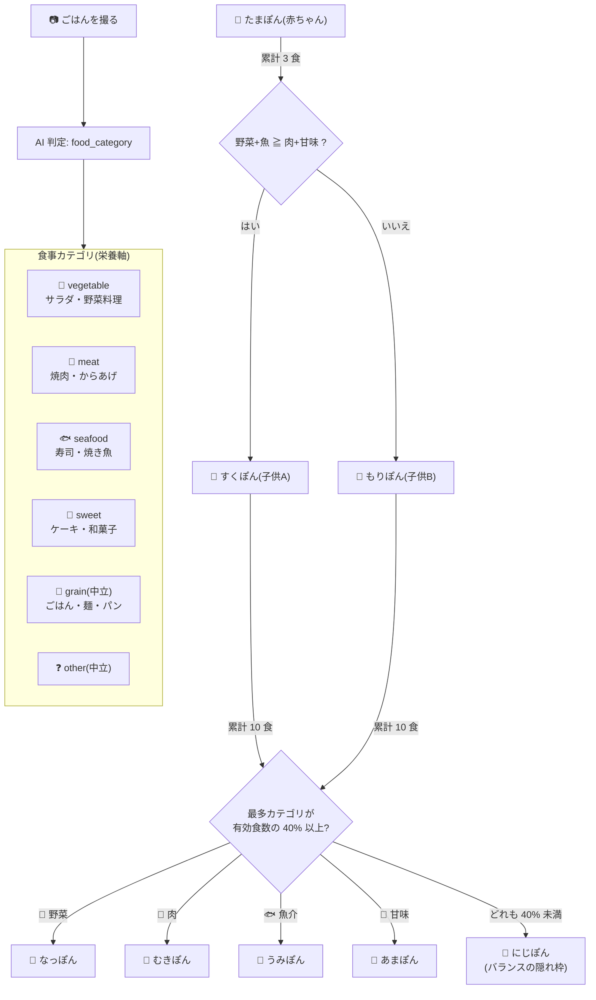

# ムシャポン — ToiCamera 育成キャラクター設定書

> issue #19 の成果物。市場調査(先行事例/命名空間/図鑑テキスト設計の 3 視点、出典は末尾)に
> 基づくキャラクター案の正典。進化メカニクス(3食/10食/40%ルール)は
> `firmware/stopwatch/src/character_logic.h` の実装が正で、本書は変更しない。

## ポジショニング(市場調査の結論)

「食べた物の種類で進化が分岐する」メカニクス自体は先行例が複数ある(たまごっちパラダイス=
最多カテゴリ変身、マイたまごっち=食材組み合わせ分岐)。**差別化はメカニクスではなく入力**:

> **実際に食べたごはんの写真で育つ、専用カメラデバイスの育成キャラ** —
> 実世界の実食事を入力に 1 体が分岐育成される事例は調査範囲内に存在しない
> (最接近の大塚製薬「もぐもぐタウン」は食材キャラの収集型で、分岐育成ではない)。

設計上の禁則(調査より):
- 偏食形態を「失敗」として説教しない。どの成体も愛せる造形にする(Slime Rancher の
  タール化・パンどろぼうの「まずい顔」が愛された構造に学ぶ)
- 「ぷに」「もぐ」「ぱく」語幹は使用しない(飽和・競合直撃・スラング衝突)

## 種族名: ムシャポン

- 語幹「**むしゃ**」= 咀嚼オノマトペで唯一の空白域(ぱく=パックマン+盗作スラング、
  もぐ=モグモン/もぐみんが企画領域に直撃、ぺろ=自治体食キャラ先行)
- 接尾辞「**ぽん**」= っち(バンダイ)/るん(タカラトミー)/モン(記号化)/みん(大塚)が
  占有済みの中の未使用枠。個体名も「〜ぽん」で統一しシリーズ識別子とする
- 検索調査で同名キャラ・商標衝突は未検出。**最終確定前に J-PlatPat(第9類・第28類)の
  正式調査が必要**(TODO)

代替案(いずれも衝突未検出):
1. **あむまる** — 幼児語「あむあむ」×まる。より低年齢向けトーン
2. **ムシャリン** — 同語幹の別語尾。女児玩具トーン寄り

### 種族設定(世界観の核)

> ごはんの湯気から生まれた小さな生きもの。じぶんではなにも食べられないため、
> 撮ってもらった写真の「おいしそう」だけを食べて育つ。

- 「**自分では食べられない**」という欠落が、"撮ってあげる"という世話行為の必然になる
  (= カメラを向ける動機がそのまま愛情表現になる製品体験)
- 食べているのは実物ではなく写真に写った「おいしそう」— だから何をどう撮ったかで育ちが変わる

## 進化ツリーと食事相関図

- 有効食数 = vegetable+meat+seafood+sweet。**grain/other は分岐に中立**
  (ラーメンやカレーで肉に振れすぎない。主食は誰の味方でもない)
- 同率は小さい form id 優先 / 退化なし / 成体後もカウント継続
- どちらの子供からでも全成体に到達可能(子供は「傾向の途中経過」であって運命ではない)

## 図鑑(全 8 形態)

> 執筆規則(調査で定式化したポケモン図鑑の型): 35〜47 字・1〜2 文 /
> 欠落は物性で書く / 感情語禁止・行動のみ / 「叶わない願い」または伝聞で締める。

| id | 名前 | 分類 | 図鑑テキスト |
|---|---|---|---|
| 0 | **たまぽん** | たまごポン | かぶった殻は、生まれた朝にだれかが食べたゆでたまごのもの。一度も脱いだことがないという。 |
| 1 | **すくぽん** | ふたばポン | 野菜と魚の「おいしそう」で育った子ども。頭の双葉は、はじめて食べたサラダの忘れもの。 |
| 2 | **もりぽん** | おかわりポン | なんでも大盛りをねだる子ども。ハチマキをほどいた姿を見た者は、まだいない。 |
| 3 | **なっぽん** | はたけポン | 頭の葉かんむりは自分では食べられない。サラダの写真を食べた日だけ、こっそり水をやっている。 |
| 4 | **むきぽん** | ちからこぶポン | 力こぶはお肉の「おいしそう」でできている。じつは、重いものを持ったことは一度もない。 |
| 5 | **うみぽん** | しおかぜポン | ひれがあるのに泳げない。海の写真ではおなかがふくれないと知っていて、波の音だけをねだる。 |
| 6 | **あまぽん** | あめだまポン | 頭のうずまきは、とけないあめ玉。あまいものの写真をかぞえながら眠るが、虫歯は一本もない。 |
| 7 | **にじぽん** | ゆげのおうポン | かたよりなく食べた者だけがなるといわれている。王冠はもらったものではなく、湯気がかたまったもの。 |

設計メモ:
- 全形態に「欠落 or 秘密」を 1 つだけ物性で置いた(殻を脱げない/双葉は忘れもの/
  力こぶは見かけだけ/泳げないひれ/とけないあめ玉)
- もりぽん・むきぽん(偏食側の形態)は弱点をユーモアで包み、説教にしない
- にじぽんだけ伝聞で「なりかた」を語り、収集欲の頂点に置く(隠れベスト枠)

## アートディレクション

- **既存スプライト(PR #17 の 8 形態)は造形をそのまま流用可能** — 本書は名称・設定の
  差し替えであり、ドット絵の変更を要求しない
- 追加生成時(#20 の食事アイテム等)は `tools/sprites/` パイプラインと本書の世界観
  (湯気・おいしそう・やわらかい輪郭)に従う

## 反映タスク(本書確定後の小タスク)

- [ ] `tools/sprites/make_home_mock.py` の NAMES / `.agent/ISSUE13_DESIGN.md` の呼称を更新
- [ ] Hackster 記事・README での紹介文に種族設定を使用
- [ ] J-PlatPat 商標調査(第9類アプリ・第28類玩具)— 「もっちまるず」の実在確認も併せて
- [ ] (任意)図鑑テキストのデバイス内表示 or ダッシュボード表示(Phase C)

## 主要出典

- たまごっちパラダイス進化仕様: https://www.beep-shop.com/list/tamagotchi/paradise_evolution / 累計1億個: https://www.bandai.co.jp/press/2025/250828.php
- モグモン(ビーワークス): https://beeworksgames.com/games/mogumon1.html / もぐもぐタウン(大塚製薬): https://www.otsuka.co.jp/company/newsreleases/2024/20240219_1.html
- ぷにるんず(タカラトミー): https://www.takaratomy.co.jp/products/punirunes/ / 妖怪ウォッチぷにぷに収益: https://gamebiz.jp/news/373326
- パクリの語源: https://dic.pixiv.net/a/%E3%83%91%E3%82%AF%E3%83%AA / パックマン40年: https://www.cnn.co.jp/style/design/35154180.html
- ゆるキャラ語尾の法則(日経): https://www.nikkei.com/article/DGXMZO84236090R10C15A3000000/
- ポケモン図鑑の型(原文実測の一次引用元): https://note.com/fairydieyoung416/n/nb05e6df265aa / 図鑑欄仕様: https://zenn.dev/eloy/articles/e8d92b60512e98
- すみっコぐらしの設計(日経クロストレンド): https://xtrend.nikkei.com/atcl/contents/18/00849/00005/ / 公式プロフィール: https://uzurea.net/sumikko-character-introduction-and-vote/
- パンどろぼう編集戦略(KADOKAWA): https://group.kadokawa.co.jp/k-insight/ki07355.html
- 憧れ/共感の2軸(榎本メソッド): https://enomotomethod.jp/column/longing_empathy/ / 弱点設定(かおプロ): https://kaopro.jp/13208
- Slime Rancher 種類: https://wikiwiki.jp/slimerancher/%E3%82%B9%E3%83%A9%E3%82%A4%E3%83%A0%E3%81%AE%E7%A8%AE%E9%A1%9E / いちばん美味しいゴミだけ食べさせて: https://www.famitsu.com/article/202507/47688
