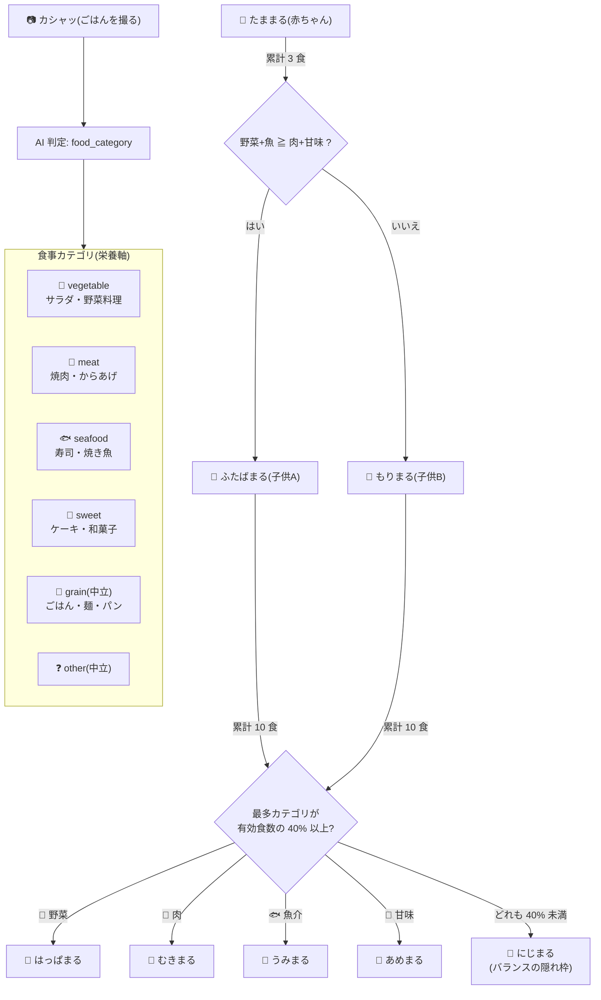

# かしゃあむ / あむまる — ToiCamera 育成キャラクター設定書(確定版)

> issue #19 の成果物・キャラクター設定の正典。市場調査(先行事例/命名空間/図鑑テキスト設計、
> 出典は末尾)に基づく 3 案比較(ムシャポン/あむまる/かしゃむ)から、ユーザー決定(2026-08-04):
> **育成アプリ(機能)名 = 「かしゃあむ」/ 種族名 = 「あむまる」**。
> カシャ(シャッター音)はアプリ名が背負い、キャラは幼児語「あむ」で呼びやすく — B+C ハイブリッド。
> 進化メカニクス(3食/10食/40%ルール)は `firmware/stopwatch/src/character_logic.h` の実装が正。

## 名称体系

| 対象 | 名称 | 役割 |
|---|---|---|
| 育成アプリ/機能名 | **かしゃあむ** | カシャッ(撮る)× あむっ(食べる)— 製品動作と遊びの一体化を名前で宣言 |
| 種族名 | **あむまる** | 子供が呼ぶ名前。発音難度最小(幼児語あむあむ+まる) |
| 個体名 | 〜まる(下表 8 形態) | シリーズ識別子 |

## 種族名: あむまる

- 語幹「**あむ**」= 幼児が実際に使う摂食オノマトペ(あむあむ)。発音難度が最小で、
  調査した咀嚼系語幹の中で先行キャラの薄い空白域
- 語尾「**まる**」= っち(バンダイ)/るん(タカラトミー)/モン(記号化)/みん(大塚)占有下での
  相対的空白枠。個体名も「〜まる」で統一しシリーズ識別子とする
- 不採用の記録: 「ぷに」(完全飽和)/「もぐ」(モグモン・もぐもぐタウンが企画領域に直撃)/
  「ぱく」(パックマン+盗作スラング)。カシャ系合成の「かしゃもぐ」「かしゃぱく」も同理由で禁止
- **TODO: J-PlatPat 商標調査(第9類・第28類)**。「もっちまるず」(カメラ内蔵育成玩具の可能性)の実在確認も併せて

## 世界観(B+C ハイブリッドの核)

> **あむまるは、ごはんの湯気から生まれた小さな生きもの。じぶんではなにも食べられない。
> でも、カシャッとシャッターが鳴ると、写真から「おいしそう」がこぼれてくる。
> それを あむっと食べて育つ。**

- 「自分では食べられない」という欠落 → **撮ってあげることが世話=愛情表現**になる
- 「**カシャッという音を聞くと、おなかが鳴る**」— シャッター音=食事の合図。
  撮影という製品の中心動作が、そのまま給餌の物語になる(ToiCamera でしか成立しない設定)
- 食べているのは実物ではなく写真の「おいしそう」— 何をどう撮ったかで育ちが変わる
- ポジショニング(調査結論): 実世界の実食事写真 × 1体の分岐育成は市場空白。
  メカニクス(食事分岐)はたまごっちパラダイスが本家であり、入力の実在性で差別化する

## 進化ツリーと食事相関図

- 有効食数 = vegetable+meat+seafood+sweet。**grain/other は分岐に中立**
  (ラーメンやカレーで肉に振れすぎない。主食は誰の味方でもない)
- 同率は小さい form id 優先 / 退化なし / 成体後もカウント継続
- どちらの子供からでも全成体に到達可能(子供は「傾向の途中経過」であって運命ではない)

## 図鑑(全 8 形態)

> 執筆規則(調査で定式化したポケモン図鑑の型): 35〜47 字・1〜2 文 /
> 欠落は物性で書く / 感情語禁止・行動のみ / 「叶わない願い」または伝聞で締める。

種族共通: **カシャッという音を聞くと、おなかが鳴る。**

| id | 名前 | 分類 | 図鑑テキスト |
|---|---|---|---|
| 0 | **たままる** | たまごまる | かぶった殻は、生まれた朝にだれかが食べたゆでたまごのもの。一度も脱いだことがないという。 |
| 1 | **ふたばまる** | ふたばまる | 野菜と魚の「おいしそう」で育った子ども。頭の双葉は、はじめて食べたサラダの忘れもの。 |
| 2 | **もりまる** | おかわりまる | なんでも大盛りをねだる子ども。ハチマキをほどいた姿を見た者は、まだいない。 |
| 3 | **はっぱまる** | はたけまる | 頭の葉かんむりは自分では食べられない。サラダの写真を食べた日だけ、こっそり水をやっている。 |
| 4 | **むきまる** | ちからこぶまる | 力こぶはお肉の「おいしそう」でできている。じつは、重いものを持ったことは一度もない。 |
| 5 | **うみまる** | しおかぜまる | ひれがあるのに泳げない。海の写真ではおなかがふくれないと知っていて、波の音だけをねだる。 |
| 6 | **あめまる** | あめだままる | 頭のうずまきは、とけないあめ玉。あまいものの写真をかぞえながら眠るが、虫歯は一本もない。 |
| 7 | **にじまる** | ゆげのおうまる | かたよりなく食べた者だけがなるといわれている。王冠はもらったものではなく、湯気がかたまったもの。 |

設計メモ:
- 全形態に「欠落 or 秘密」を 1 つだけ物性で置く(殻を脱げない/双葉は忘れもの/
  力こぶは見かけだけ/泳げないひれ/とけないあめ玉)
- 偏食側の形態(もりまる・むきまる)は弱点をユーモアで包み、説教にしない
  (Slime Rancher のタール化・パンどろぼうの「まずい顔」が愛された構造に学ぶ)
- にじまるだけ伝聞で「なりかた」を語り、収集欲の頂点に置く(隠れベスト枠)

## アートディレクション

- **既存スプライト(PR #17 の 8 形態)は造形をそのまま流用可能** — 本書は名称・設定の
  差し替えであり、ドット絵の変更を要求しない
- 比較検討時の参考: 案B の水彩絵本トーン(issue #19 コメントの b_lineup.png)は
  絵本・グッズ展開時のキービジュアル方向として保管
- 食事アイテム等の追加生成(#20)は `tools/sprites/` パイプラインと本書の世界観
  (湯気・おいしそう・カシャッ・やわらかい輪郭)に従う

## 反映タスク(本書確定後の小タスク)

- [ ] `tools/sprites/make_home_mock.py` の NAMES / `.agent/ISSUE13_DESIGN.md` の呼称を「〜まる」系へ更新
- [ ] Hackster 記事・README での紹介文に種族設定(カシャッ=食事の合図)を使用
- [ ] J-PlatPat 商標調査(第9類・第28類): 「あむまる」「かしゃあむ」+「もっちまるず」実在確認
- [ ] (任意)図鑑テキストのデバイス内表示 or ダッシュボード表示(Phase C)

## 主要出典

- たまごっちパラダイス進化仕様: https://www.beep-shop.com/list/tamagotchi/paradise_evolution / 累計1億個: https://www.bandai.co.jp/press/2025/250828.php
- モグモン(ビーワークス): https://beeworksgames.com/games/mogumon1.html / もぐもぐタウン(大塚製薬): https://www.otsuka.co.jp/company/newsreleases/2024/20240219_1.html
- ぷにるんず(タカラトミー): https://www.takaratomy.co.jp/products/punirunes/ / 妖怪ウォッチぷにぷに収益: https://gamebiz.jp/news/373326
- パクリの語源: https://dic.pixiv.net/a/%E3%83%91%E3%82%AF%E3%83%AA / パックマン40年: https://www.cnn.co.jp/style/design/35154180.html
- ゆるキャラ語尾の法則(日経): https://www.nikkei.com/article/DGXMZO84236090R10C15A3000000/
- ポケモン図鑑の型(原文実測の一次引用元): https://note.com/fairydieyoung416/n/nb05e6df265aa / 図鑑欄仕様: https://zenn.dev/eloy/articles/e8d92b60512e98
- すみっコぐらしの設計(日経クロストレンド): https://xtrend.nikkei.com/atcl/contents/18/00849/00005/ / 公式プロフィール: https://uzurea.net/sumikko-character-introduction-and-vote/
- パンどろぼう編集戦略(KADOKAWA): https://group.kadokawa.co.jp/k-insight/ki07355.html
- 憧れ/共感の2軸(榎本メソッド): https://enomotomethod.jp/column/longing_empathy/ / 弱点設定(かおプロ): https://kaopro.jp/13208
- Slime Rancher 種類: https://wikiwiki.jp/slimerancher/%E3%82%B9%E3%83%A9%E3%82%A4%E3%83%A0%E3%81%AE%E7%A8%AE%E9%A1%9E / いちばん美味しいゴミだけ食べさせて: https://www.famitsu.com/article/202507/47688
