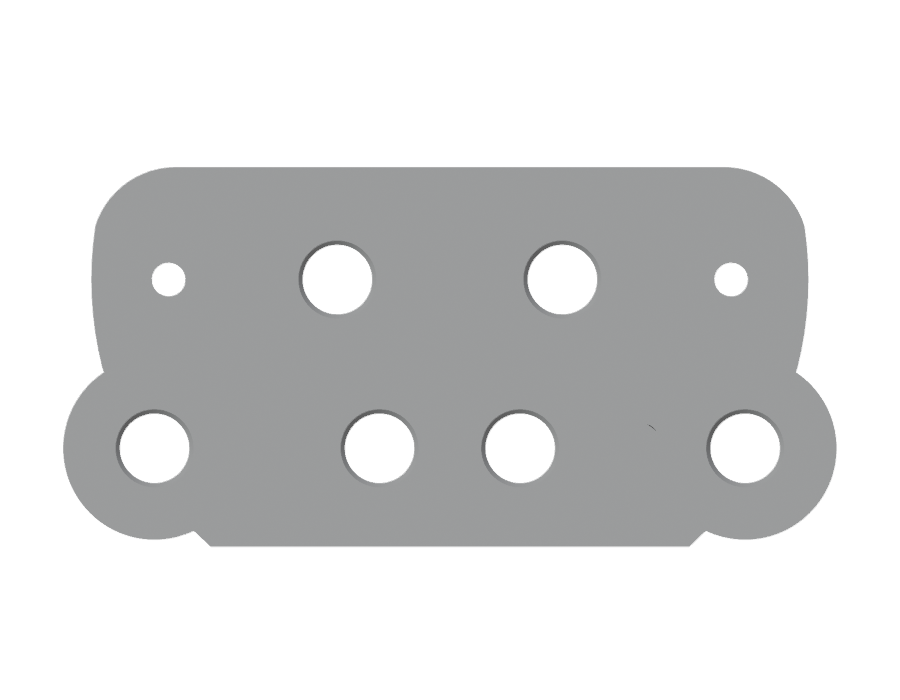
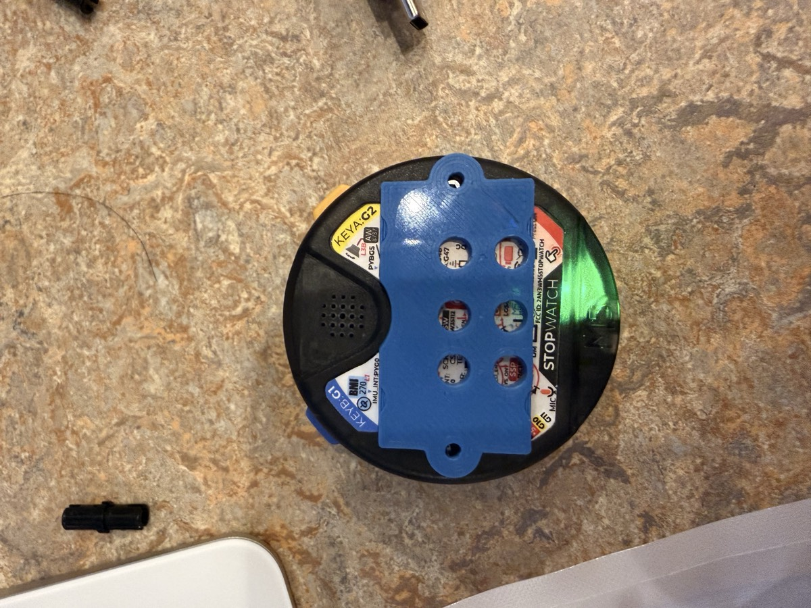
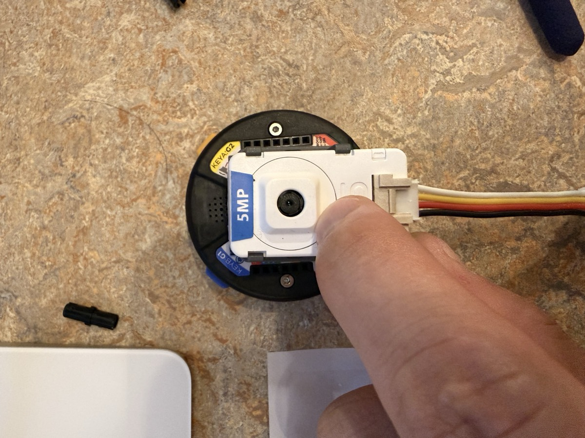
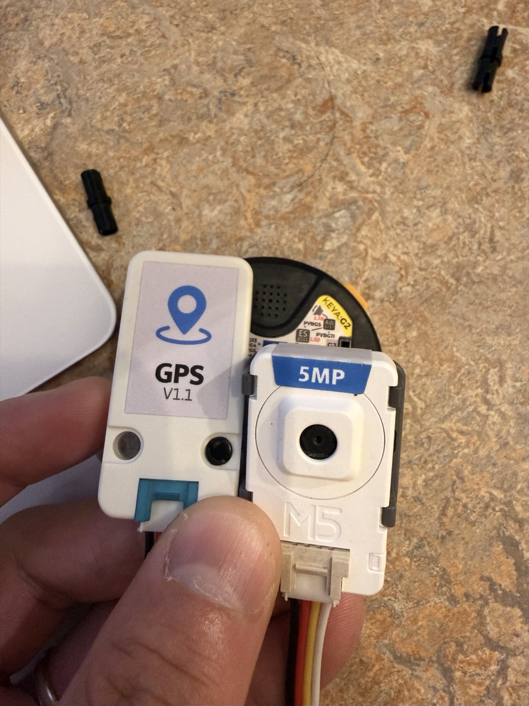
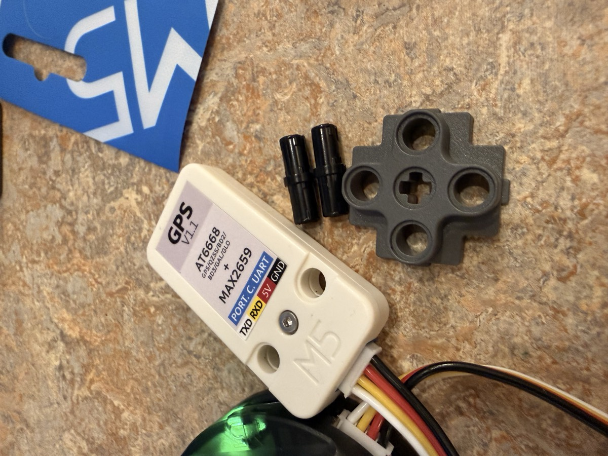
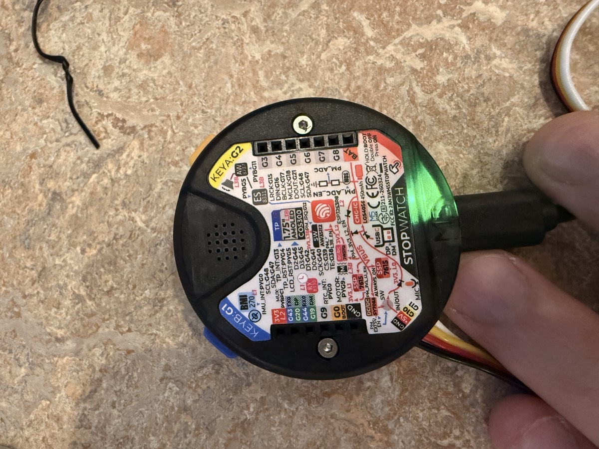

# アタッチメント(バックパックプレート)印刷・組立ガイド

ToiCamera のカメラ・GPS はケースで覆わず、**ウォッチ背面にネジ止めした 3D プリントプレートに LEGO テクニック互換ジョイントでクリップする**オープン構成です。



## 用意するもの

| 品目 | 備考 |
|---|---|
| `case/blender/out/toicamera_duo.stl` | **最終版**。カメラ単体/カメラ+GPS の両対応 |
| PLA フィラメント | 約 10g |
| **M2 × 10mm タッピングネジ × 2** | ウォッチの元ネジ(M2×8 実測)を置き換える。11mm は入手性が低いため 10mm 推奨 |
| M5Stack CLIP-A / CLIP-B キット | LEGO テクニック互換ピンでユニットを保持 |

STL 3 種の使い分け: `toicamera_duo.stl`(**推奨・最終版**)/ `toicamera.stl`(2 列 12 穴の縦長ラック)/ `toicamera_grid3.stl`(3 列 11 穴・ウォッチ円内)。

## 印刷設定(Bambu Studio / 各社スライサー共通)

- **向き: 隆起した穴帯を上にして平置き**(穴の軸が垂直になり真円が出ます)— この向きなら**サポート不要**
- レイヤー 0.2mm / インフィル 20〜30% / PLA
- 所要 約 20〜30 分
- 穴がきつい/緩い場合: `case/blender/build_case.py` の `TECHNIC_HOLE_PRINT_COMP`(既定 +0.15mm)を ±0.1 調整して再生成
  ```bash
  /Applications/Blender.app/Contents/MacOS/Blender -b --python case/blender/build_case.py -- --part all --out case/blender/out/toicamera.stl
  ```

## 取り付け

1. ウォッチ背面の **上下 2 本のネジ(縦センターラインの両端・40mm 間隔)** を外す
2. プレートを背面に当て、**M2×10 で共締め**(締めすぎ注意 — 樹脂ボスです)
3. プレートの向き: **穴のない広い側がボタン・スピーカー側**。スピーカーやボタンには一切かかりません



## ユニットの取り付け(ジョイントは 16mm スパン = 1 穴飛ばし)

### カメラ単体 — 背面中央・横向き

中央の **横 2 穴(16mm)** に CLIP-A を挿し、カメラを横向きでクリップ。レンズがウォッチ中央に来ます。



### カメラ + GPS — 下段に縦向きで並べる

下段の **左右 2 ペア(各 16mm)** に 1 台ずつ。両ユニットを縦向きで横に並べます(GPS はユニット自身の 2 穴にピンを直挿しでも OK)。



CLIP のパーツ構成(十字コネクタ+テクニックピン):



## 参考: ウォッチ背面のレイアウト

ネジ(40mm 間隔)・スピーカー(ボタン側)・2.54mm 拡張バス・Grove ポートの位置関係:



配線(Grove の Y 分岐)は **[Y 字ケーブルの作り方](y-cable.html)** を参照してください。
