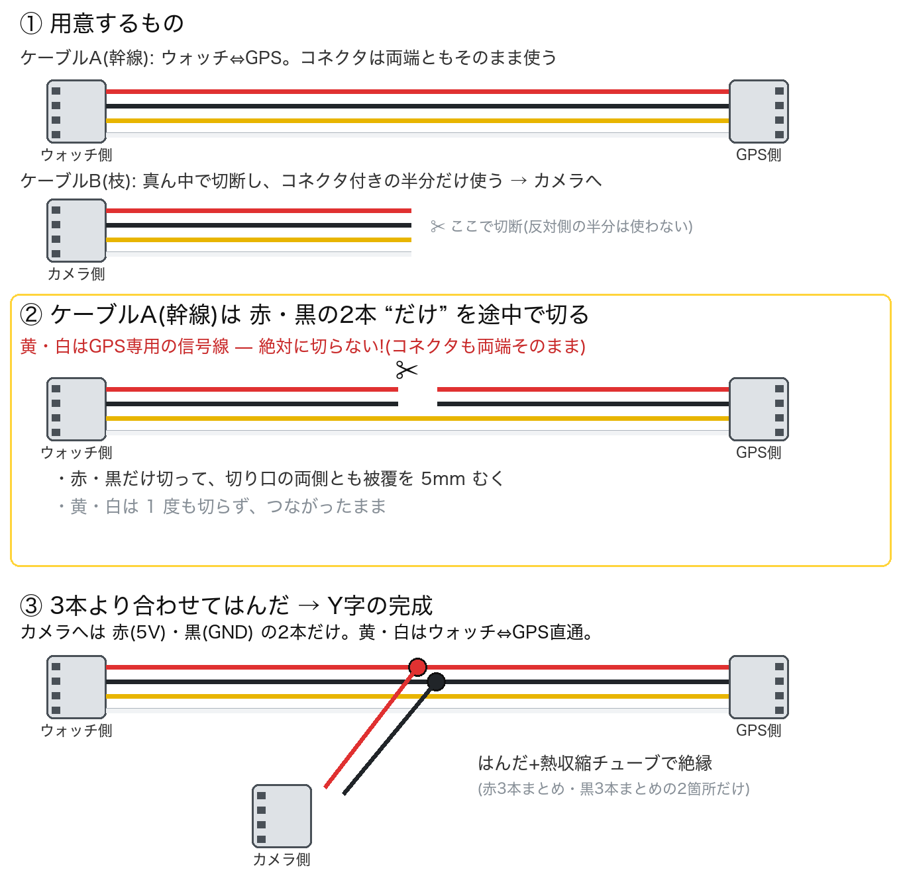
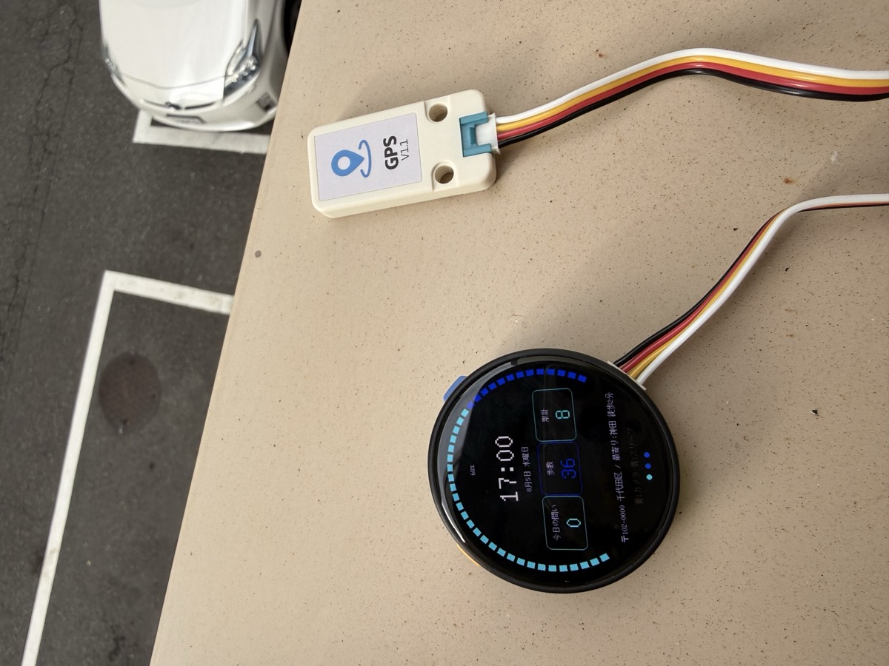

# Y 字ケーブル(Grove 分岐ハーネス)の作り方

ウォッチの Grove ポートは 1 つですが、**カメラと GPS を同時に使う**にはこのポートを分岐します。ポイントは **「切るのは赤・黒の 2 本だけ」**。

## 仕組み

Grove(HY2.0-4P)の 4 線の役割:

| 線色 | 信号 | カメラ | GPS |
|---|---|---|---|
| 赤 | 5V | ✓(給電のみ) | ✓ |
| 黒 | GND | ✓ | ✓ |
| 黄 | G10(UART RX) | 使わない | ✓(NMEA) |
| 白 | G11(UART TX) | 使わない | ✓ |

カメラは Wi-Fi で通信するため **5V/GND の給電だけ**あれば動きます。

よくある疑問: 「GPS へ行くケーブルも切らないと Y にならないのでは?」— **その通りです**。GPS へ行く幹線ケーブルも**赤・黒の 2 本だけは途中で切ります**。切らないのは**黄・白の 2 本と、両端のコネクタ**です(だからコネクタの付け直しが要らず、GPS の信号線も無傷のまま)。

## 図解

## 手順(はんだ付け・約 15 分)

1. **電源 OFF**(ウォッチの電源を切り、USB も抜く)
2. Grove ケーブルを 2 本用意(M5 ユニット付属の予備で OK)
   - **ケーブル A = 幹線**(ウォッチ⇔GPS)。コネクタは両端ともそのまま使う
   - **ケーブル B = カメラ枝**。真ん中で切断し、コネクタ付きの半分だけ使う
3. ケーブル B(枝): **赤・黒だけ被覆を 5mm むく**。黄・白は根本で切ってテープ絶縁
4. ケーブル A(幹線): 分岐させたい位置で **赤と黒の 2 本だけを切断**し、切り口の両側とも 5mm むく(**黄・白は 1 度も切らない**)
5. 3 本より合わせ ×2 箇所: 「幹線の赤 2 端 + 枝の赤」をねじって**はんだ付け**。黒も同様
6. **熱収縮チューブ**で絶縁(はんだ前に通しておく)。無ければビニールテープ可
7. 通電前にテスターで 5V–GND 間のショートが無いことを確認 → 電源 ON → カメラの LED 点灯と、シリアルの `[toi] gps: bytes=...` 増加で確認

## はんだごてが無い場合

- **はんだシールコネクタ**(低温はんだ入り熱収縮チューブ): 線を差してライター/ヒートガンで炙るだけ
- エレクトロタップ: 工具不要だが Grove の細線(AWG26 相当)には**細線対応品**を選ぶこと

## 完成イメージ

カメラ単体で使う間は Y ケーブル不要(直結のまま)。GPS を追加するときに作ればOK です。

取り付け位置は **[印刷・組立ガイド](print-guide.html)** を参照してください。
